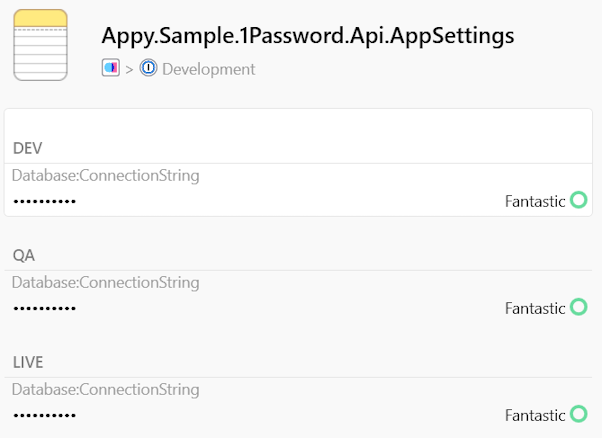

# `Appy.Configuration`


## What is Appy.Configuration?

Configuration providers for NETCore 2.2, 3.0 and 3.1+.

## Configuration Providers

| Package | Latest Stable |
| --- | --- |
| [Appy.Configuration.WinRegistry](https://www.nuget.org/packages/Appy.Configuration.WinRegistry) | [](https://www.nuget.org/packages/Appy.Configuration.WinRegistry) |
| [Appy.Configuration.1Password](https://www.nuget.org/packages/Appy.Configuration.1Password) | [](https://www.nuget.org/packages/Appy.Configuration.1Password) |
| [Appy.Tool.1Password](https://www.nuget.org/packages/Appy.Tool.1Password) | [](https://www.nuget.org/packages/Appy.Tool.1Password) |

## Table of Contents

1. [Windows Registry Configuration Provider](#windows-registry-configuration-provider)  
    1.1. [Example](#windows-registry-example)    
2. [1Password Configuration Provider](#1password-configuration-provider)
    2.1. [Prerequisites](#1password-prerequisites)
    2.2. [Signin to 1Password](#signin-to-1password)
    2.3. [Example](#1password-example)
    2.4. [Appy dotnet Tool](#appy-dotnet-tool)
    2.5. [Example](#appy-dotnet-tool-example)

## Windows Registry Configuration Provider

The Windows registry has been with us for a long time and has served us well. Especially when we work locally or try to debug a project.

With this extension you can easily configure the loading of values from a section of your windows registry to your NETCore project configuration builder.

### Windows Registry Example

Let's imagine we have a configuration file like the following appSettings.json:

```json
...
"Database": {
    "ConnectionString": ""
}
...
```

And a user windows registry section like:

```csharp
HKEY_CURRENT_USER\SOFTWARE\YOUR_ORG\Settings
```

With the following values:

```csharp
Database:ConnectionString: "Data Source=(LocalDb)\\mssqllocaldb;Initial Catalog=local-org-database;Integrated Security=True"
```

Then, the only thing we need to do is register an action to load the configuration values on our Program.cs. 

```csharp
public class Program
{
    public static void Main(string[] args) =>    
        CreateWebHostBuilder(args).Build().Run();    

    public static IWebHostBuilder CreateWebHostBuilder(string[] args) =>
        Host.CreateDefaultBuilder(args)
            .ConfigureAppConfiguration(builder => 
            {
                builder.AddRegistrySection(() => Microsoft.Win32.Registry.CurrentUser, "Software\\YOUR_ORG\\Settings");
            }
            .UseStartup<Startup>();
}    
```

And this way we will have our configuration values ready to use like with any appSettings.json:

```csharp
public class Startup
{
    readonly IWebHostEnvironment _host;
    readonly IConfiguration _config;

    public Startup(IConfiguration config, IWebHostEnvironment host)
    {
        _host = host;
        _config = config;
    }
        
    public void ConfigureServices(IServiceCollection services)
    {
        var databaseSettings = new DatabaseSettings();
        
        var databaseSettings = _config.GetSection("Database").Bind(databaseSettings);
        ....
    }
}

public class DatabaseSettings
{
    public string ConnectionString { get; set; }
}
```

To switch between environments, we would have a registry key with the settings for each one, like:

```
QA   -> "Software\\YOUR_ORG\\QA_Settings\\Database:ConnectionString"
LIVE -> "Software\\YOUR_ORG\\LIVE_Settings\\Database:ConnectionString"
```

Then we would only have to rename the registry environment folder key that we want to use to 'Settings', 
every time we need it and return the previous one to its original name.

```
QA   -> "Software\\YOUR_ORG\\QA_Settings" -> rename -> "Software\\YOUR_ORG\\Settings"      (We want to work with QA)
LIVE -> "Software\\YOUR_ORG\\Settings"    -> rename -> "Software\\YOUR_ORG\\LIVE_Settings" (LIVE back to his normal name)
```

Apart of all these, we could then simply create an extension to load all our configurations in just one line,
with the windows registry configuration in Development and the rest of the appSettings configurations.

```csharp
public class Program
{
    public static void Main(string[] args) =>    
        CreateWebHostBuilder(args).Build().Run();    

    public static IHostBuilder CreateWebHostBuilder(string[] args) =>
        Host.CreateDefaultBuilder(args)
            .AddYourOrgAppConfiguration()
            .UseStartup<Startup>();
}    
```

Then, you can create some configuration extensions for your organization and override the config values in order. All these if necessary, 
can be preconfigured in a nuget package for your organization, which each developer can use later in their projects.

```csharp
public static class YourOrgConfigurationExtensions
{
    public static IConfigurationBuilder AddYourOrgRegistrySection(
        this IConfigurationBuilder builder,
        Action<WinRegistryConfigurationSource> configureSource = null)
    {
        return builder.AddRegistrySection(() =>
                Microsoft.Win32.Registry.CurrentUser, "Software\\YOUR_ORG\\QA_Settings");
    }

    public static IHostBuilder AddYourOrgAppConfiguration(this IHostBuilder hostBuilder)
    {
        hostBuilder.ConfigureAppConfiguration((hostingContext, config) =>
        {
            config.AddYourOrgConfigurationBuilders(hostingContext.HostingEnvironment);
        });

        return hostBuilder;
    }

    public static IConfigurationBuilder AddYourOrgConfigurationBuilders(this IConfigurationBuilder builder, IHostEnvironment env)
    {
        builder
            .AddJsonFile("appsettings.json", optional: true, reloadOnChange: true)
            .AddJsonFile($"appsettings.{env.EnvironmentName}.json", optional: true, reloadOnChange: true)
            .AddEnvironmentVariables();

        if (env.IsDevelopment())
        {
            builder
                .AddYourOrgRegistrySection();
        }

        return builder;
    }
}
```

## 1Password Configuration Provider

### Prerequisites

First, we should install the [1Password CLI](https://support.1password.com/command-line/). 

#### Windows
For an easy installation, we recommend that you first install [Chocolatey Package Manager](https://chocolatey.org/install).

Open a Powershell console and install 1Password CLI:

```console
choco install op
```

#### MacOS
For an easy installation, we recommend that you first install [Brew Package Manager](https://brew.sh/).

Open a console and install 1Password CLI using brew cask:

```console
brew cask install 1password-cli
```

#### Linux

Please, follow the official ['Getting started docs from 1Password'](https://support.1password.com/command-line-getting-started/)

### Signin to 1Password:

#### First Time access

Execute the next command to signin to 1Password using the CLI. 
```
op signin yourorg.1password.com user@yourorg.com 
```

It will ask for your secret key and your password. You can get the first one from your 1Password Desktop or Mobile App.

#### Later time access

For subsequent accesses, it will only be necessary the next command:

```console
op signin yourorg
```

#### Session Expiration

It is necessary to know that 1Password sessions with automatically expire after 30 minutes of inactivity, otherwise, the session will be renewed for another 30 minutes.

### 1Password Example



TODO 

### 1Password Appy Tool

```
dotnet tool install -g appy-op
```

TODO

## Contribute
It would be awesome if you would like to contribute code or help with bugs. Just follow the guidelines [CONTRIBUTING](https://github.com/YellowLineParking/Appy.Configuration/blob/master/CONTRIBUTING.md).

## Additional Resources
* [WinRegistry Configuration based on GeorgeTsaplin project](https://github.com/GeorgeTsaplin/Configuration.WinRegistry)